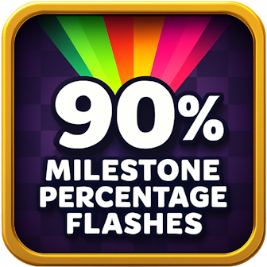

# Milestone Percentage Flashes

A Geometry Dash mod that adds colorful visual celebrations when you reach progress milestones!



## Features

✨ **Visual Milestone Celebrations**: Flash animations when you reach:
- **25%** - Bright color flashes with scaling effects
- **50%** - Dynamic color sequences (red → yellow → green)
- **75%** - Satisfying visual feedback for major progress
- **90%** - Encouraging flash as you near completion
- **95%** - Final push animation for the home stretch

🎨 **Smooth Animations**: Uses Cocos2d-x CCTintTo and CCScaleTo for fluid color transitions and scaling effects

🔧 **Clean Integration**: Works seamlessly with existing UI, animations reset cleanly to original state

🎯 **Reliable Detection**: Multiple hook strategies ensure milestone detection works across all level types

## Installation

1. Download and install [Geode Mod Loader](https://geode-sdk.org/)
2. Download the latest release of this mod
3. Place the `.geode` file in your `geode/mods` folder
4. Launch Geometry Dash and enjoy the milestone celebrations!

## Usage

Simply play any level normally! The mod will automatically detect when you reach milestone percentages and trigger the colorful flash animations on the percentage label. No configuration needed - just play and enjoy the visual celebrations of your progress!

## Build instructions
For more info, see [our docs](https://docs.geode-sdk.org/getting-started/create-mod#build)
```sh
# Assuming you have the Geode CLI set up already
geode build
```

# Resources
* [Geode SDK Documentation](https://docs.geode-sdk.org/)
* [Geode SDK Source Code](https://github.com/geode-sdk/geode/)
* [Geode CLI](https://github.com/geode-sdk/cli)
* [Bindings](https://github.com/geode-sdk/bindings/)
* [Dev Tools](https://github.com/geode-sdk/DevTools)
